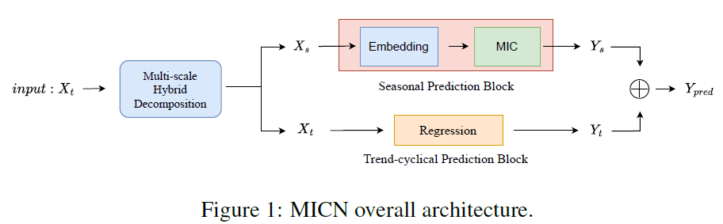
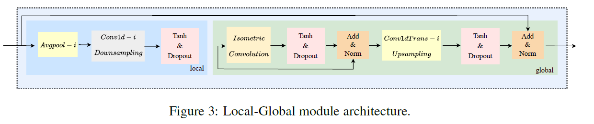
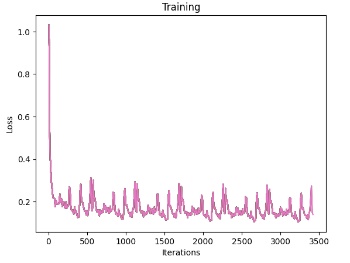
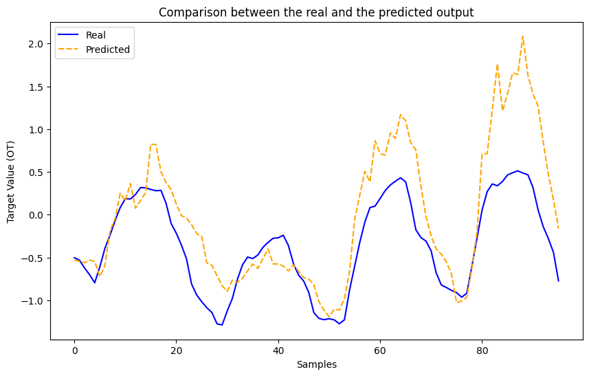

###MICN: Multi-scale local and global context modeling for long-term time series forecasting

The project implements the architecture designed in the paper [MICN: Multi-scale Local and Global Context Modeling for Long-term Series Forecasting](https://openreview.net/pdf?id=zt53IDUR1U).

#### Description

It focuses on the task of long-term forecasting. The problem to be solved is to predict values for a future period $X_{t+1},X_{t+2},...,X_{t+T−1},X_{t+T}$, based on observations from a historical period $X_1,X_2,...,X_{t−1},X_t$.

The aim is to implement the forecasting task with a more efficient model that relies on convolutions instead of the existing self-attention mechanisms.

For implementation purposes, we used a dataset containing the electricity consumption of 321 customers recorded hourly from 2012 to 2014. 

---
#### The overall model architecture


<br>

- $\textbf{Multi-scale hybrid decomposition block}$

This module returns the ***seasonal*** part and ***trend-cyclical*** part of the input data that will be predicted by two separate blocks.

<br>

- $\textbf{Trend-cyclical prediction block}$

This block predicts trend-cyclical information using the linear regression strategy on the trend-cyclical part of data previously extracted.

<br>

- $\textbf{Seasonal prediction block}$


This block performes 3 kinds of embeddings of the seasonal part: time features encoding, positional encoding and value embedding. 
Then there is a $\textit{Multi-scale isometric Convolution(MIC) Layer}$, using different branches (corresponding to different scale sizes used to model potentially different temporal patterns). On each branch, there is a local-global module that  extracts the local features and the global correlations of the sequence. The architecture of the local-global module is the following one:



This block adopts downsampling one-dimensional convolution for local features extraction and isometric convolution and up-sampling transposed convolution for global correlations discovery.

---
#### Results
Training loss on 6 epochs of 570 batches each.


Testing on a random batch:



#### How to run the code
Install the needed packets to run the code with the command:
```
pip install torch numpy pandas scikit-learn matplotlib seaborn
```
In order to run the code, open the ```MICN.ipynb``` and run each cell sequentially. For testing purposes, we loaded the weights of the trained model in ```checkpoint.pth```.